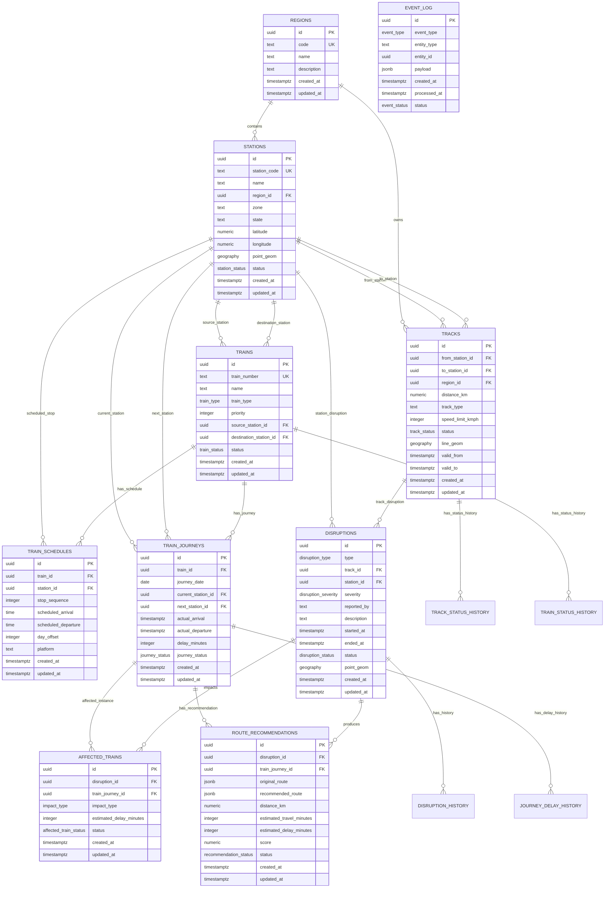

# ER Diagram

Phase 7 adds `train_journeys 1 -> many journey_status_history`, a composite `affected_trains(disruption_id,train_journey_id) 1 -> many route_recommendations` relationship, and `logic_artifacts` deployment metadata. Existing diagrams below describe the original Phase 2 baseline; current additions are listed in `DATA_DICTIONARY.md` and `PHASES_7_9_DESIGN.md`.

This document defines the conceptual entity model for the railway disruption database. It is design documentation only; migration SQL belongs in Phase 3.

## Schema Scope

Primary schema for MVP: `railway_main`.

Future logical distribution schemas:

- `railway_north`
- `railway_central`
- `railway_south`

For the MVP, regional separation is represented by the `regions` entity and can later be expanded into regional schemas.

## Entity Relationship Diagram

## Design Notes

- `tracks` represents directional operational connectivity. If a physical track is bidirectional, Phase 4 seed data should either create two directional rows or store a bidirectional flag and let graph sync create two relationships.
- `train_schedules` stores planned stops. `train_journeys` stores a specific running instance of a train on a date.
- `disruptions` supports both track-level and station-level disruptions. At least one of `track_id` or `station_id` must be present.
- `route_recommendations` stores JSON route snapshots because each recommendation is an analysis result, not a normalized master route.
- History tables are append-only audit tables and are intentionally separated from current-state tables.
