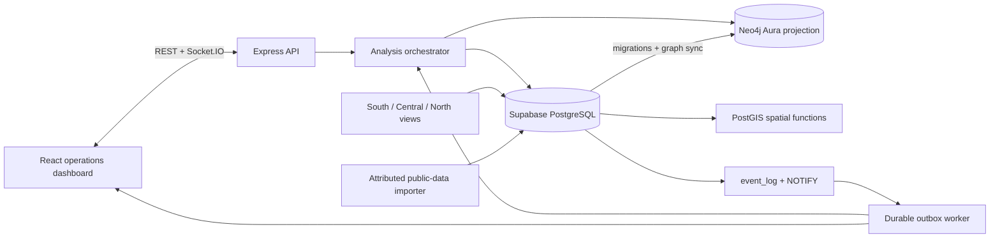
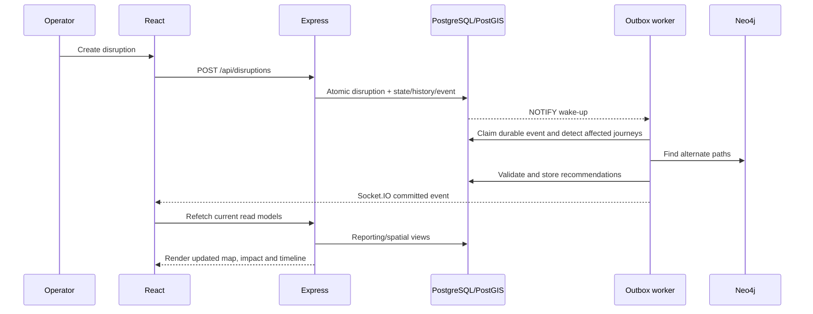

# System architecture

## Responsibilities

PostgreSQL owns stations, tracks, schedules, journeys, disruptions, recommendations, history, constraints, and the durable event outbox. PostGIS owns geometry validation, distance/intersection analysis, nearby-station lookup, and GeoJSON generation. Neo4j contains only synchronized station/track projections used to propose paths; every candidate is revalidated against current PostgreSQL availability and time windows.

The Express layer validates HTTP input and coordinates the database/graph services. It does not duplicate SQL impact, feasibility, transition, or reporting rules. The worker consumes `event_log` with leases and fencing tokens, runs analysis, and publishes committed events to Socket.IO. PostgreSQL `NOTIFY` is a wake-up hint; polling the durable outbox prevents notification loss from losing work.

The React layer uses TanStack Query for server state, Socket.IO only to invalidate/refetch committed state, React Router for four screens, Leaflet for PostGIS GeoJSON, and Recharts for delay exposure. Feature pages are code-split; business decisions remain in the backend/database.

## End-to-end state flow

## Trust and deployment boundaries

- Anonymous and authenticated Supabase roles have no access to `railway_main`; API access is server-side.
- `railway_app` has the runtime table/routine privileges and Row Level Security policies, but not migration rewrite privileges.
- TLS verification is secure by default; insecure remote TLS requires an explicit opt-in.
- API bearer authentication is required for non-loopback/shared deployment.
- The supported realtime topology is one API/Socket.IO process. Multiple instances require a shared Socket.IO adapter.

