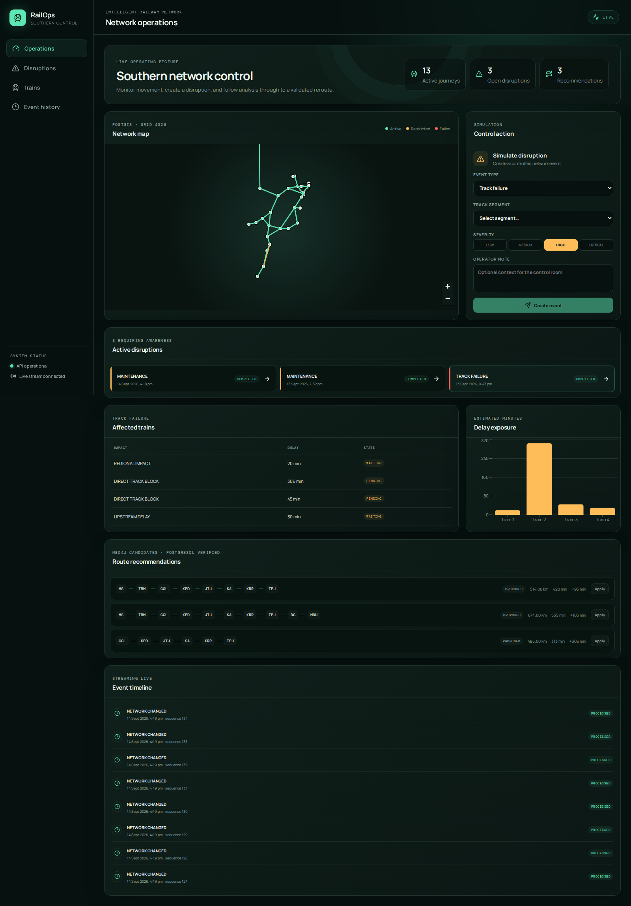
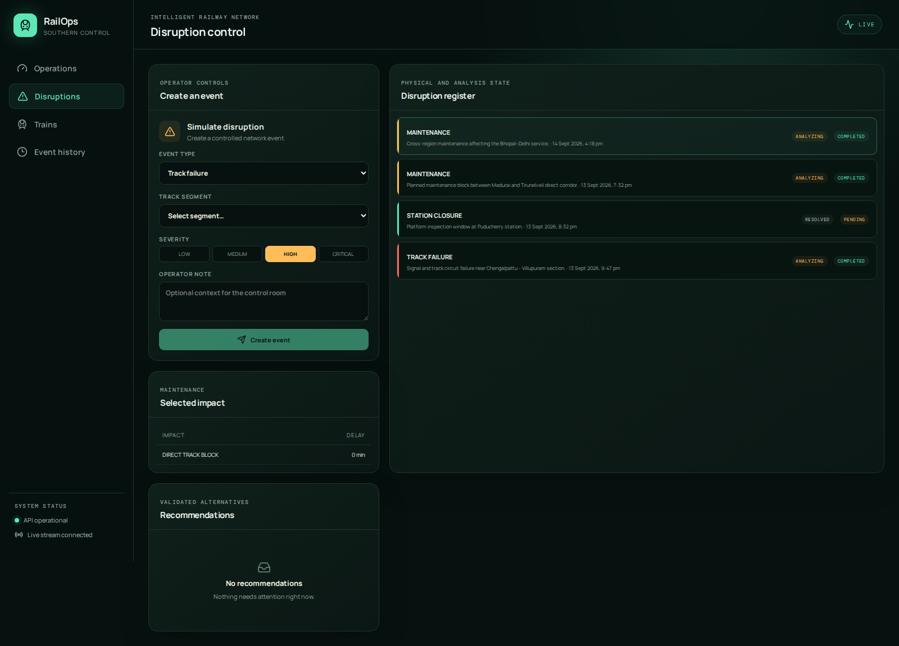
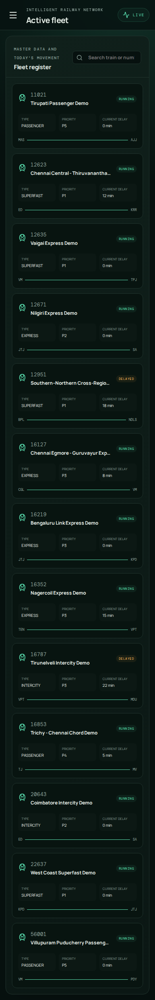

# Final demonstration workflow

## Prepare

Run the setup in [SETUP.md](SETUP.md), then start the backend and frontend. Confirm all three health endpoints and the green API/live indicators.

## Main disruption-to-reroute demo

1. Open **Operations** and point out the PostGIS network map, active journeys, disruptions, and durable event timeline.
2. In **Control action**, choose an active track, select **Track failure**, choose a severity, and create the event.
3. Explain that PostgreSQL changes the physical track state and writes disruption, history, and outbox records atomically.
4. Watch the live event arrive. The worker claims it, asks SQL for affected journeys, requests Neo4j alternatives, revalidates them in PostgreSQL, and stores feasible recommendations.
5. Select the disruption. Show the affected-train delay, alternate route, and event ordering.
6. Apply a proposed recommendation. The guarded stored procedure updates the journey and history once; a repeated application is an idempotent no-op.

The UI can create all supported types. Scripted API scenarios are also available while the backend is running:

```bash
npm run demo:scenario -- --type=track-failure --apply
npm run demo:scenario -- --type=station-closure --apply
npm run demo:scenario -- --type=maintenance --apply
```

Each command chooses an eligible target and skips targets already carrying an unresolved disruption.

## Distributed database demo

```bash
npm run demo:distributed
npm run validate:scenario
```

Show `railway_main.v_cross_region_journeys`: train 12951 crosses SR, CR and NR. Its Bhopal–Delhi maintenance event is visible through the same impact logic. The three schemas are read projections in this single-cloud classroom deployment; [DISTRIBUTED_DATABASE.md](DISTRIBUTED_DATABASE.md) explains the FDW upgrade path.

## Public-data and rebuild demo

```bash
node scripts/download-osm-stations.mjs --bbox=12.5,79.8,13.3,80.3 --region=SR
node scripts/import-public-data.mjs --file data/raw/osm-stations.json --apply
npm run graph:sync
npm run validate:db
```

Repeat the import to show checksum idempotency. OpenStreetMap attribution is recorded with the batch and each source record. The fallback seed is still available for a deterministic classroom reset.

## Presentation screenshots







